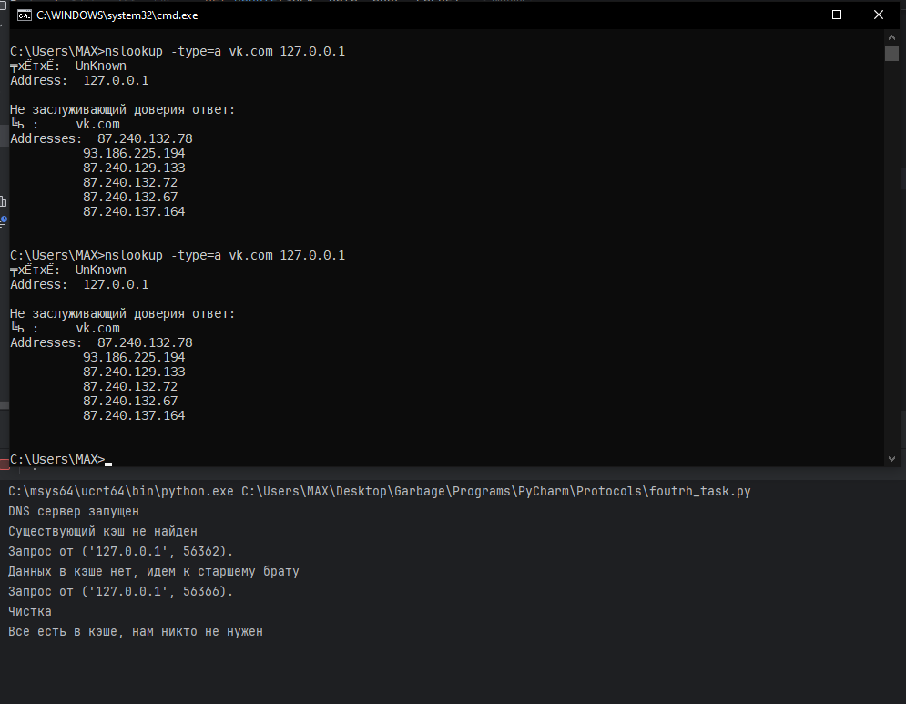
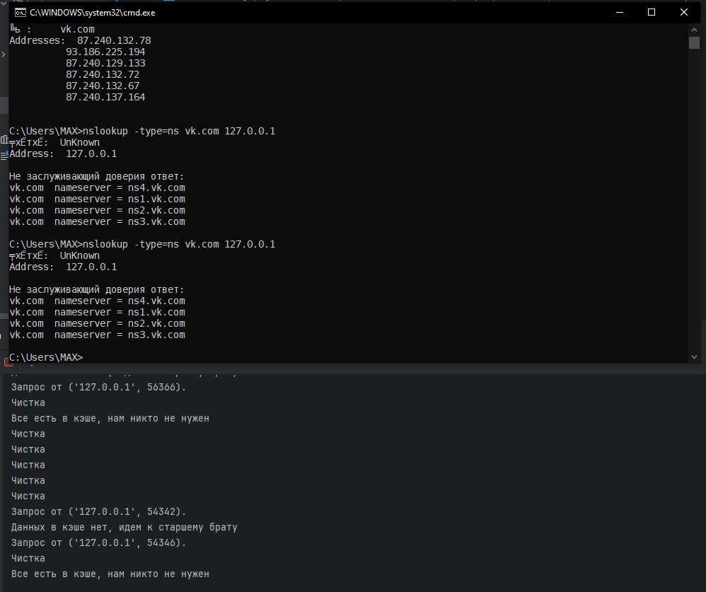
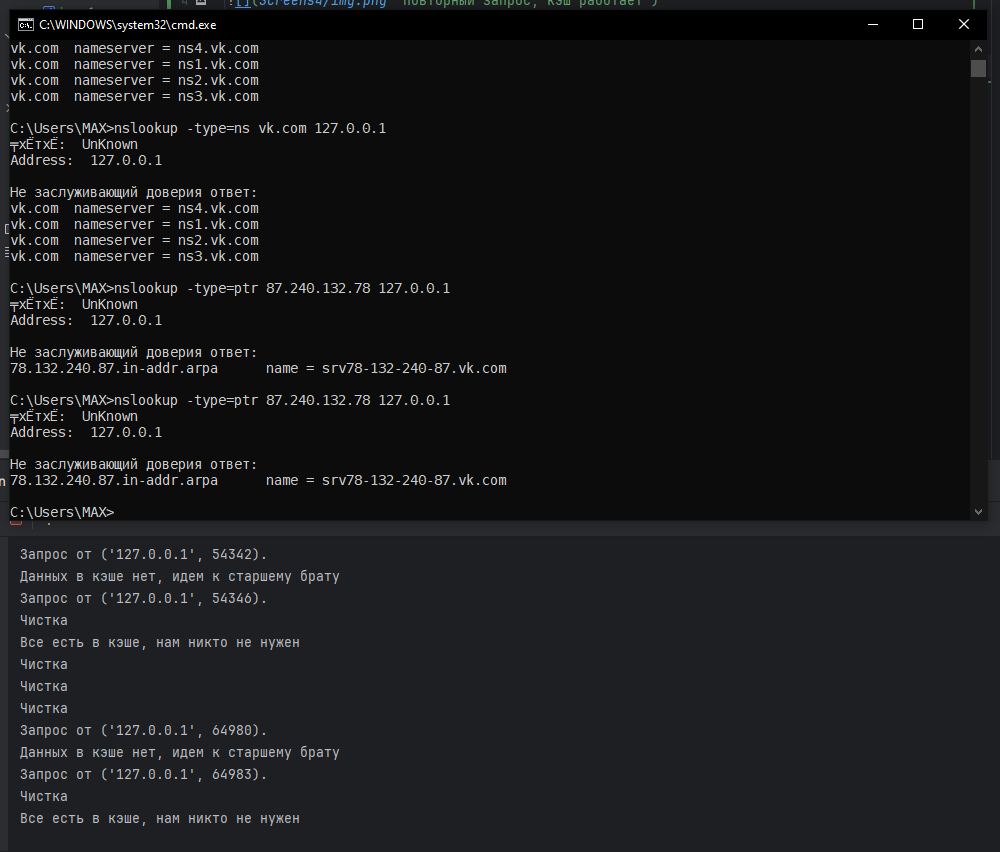
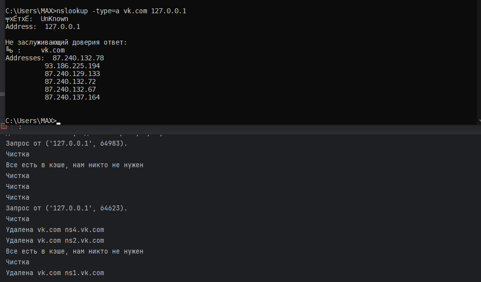
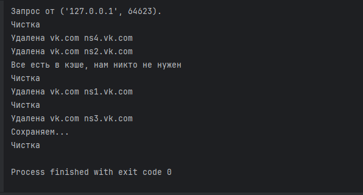
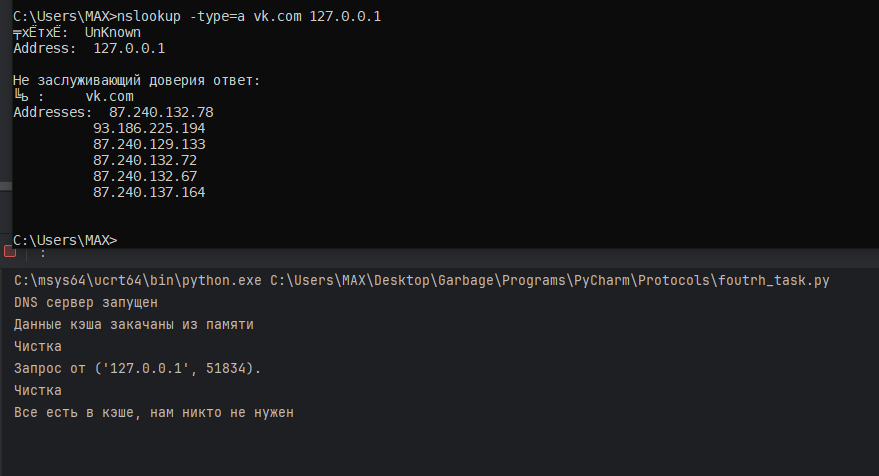

# Кэширующий ДНС сервер

Повторный запрос, кэш работает

С NS тоже

И с PTR

-type=A vk.com все еще в кэше, NS начали удаляться

При выходе сохраняет кэш

При повторном запуске vk.com все еще в кэше

