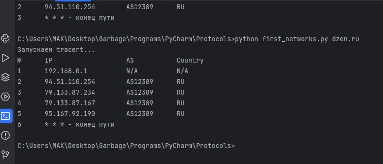
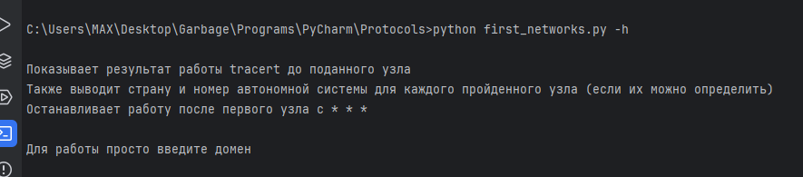

# Первая задача (tracert)

Попытка обратится по текстовому адресу без интернета

Попытка обратится по IP-адресу без интернета

Нормальная работа

Сервис Ipinfo не отвечает

Неразрешимый адрес

Полный проход пути

Без аргументов

Справка

