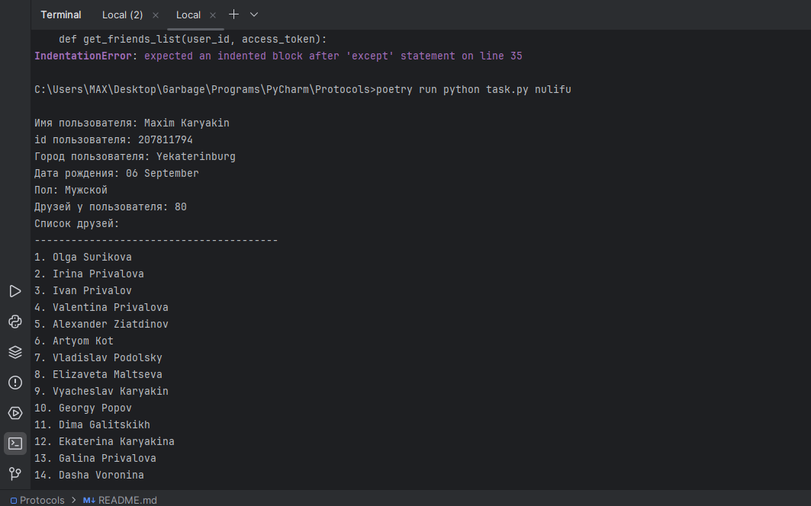
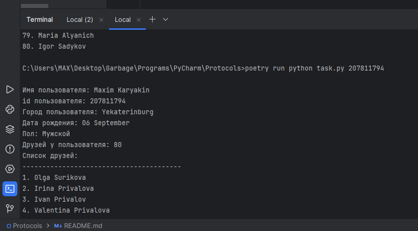
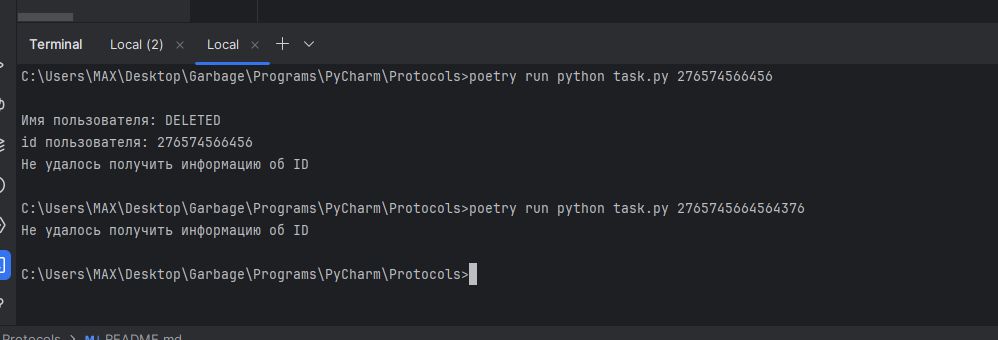
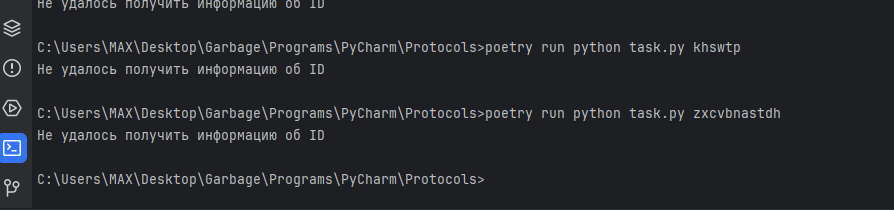
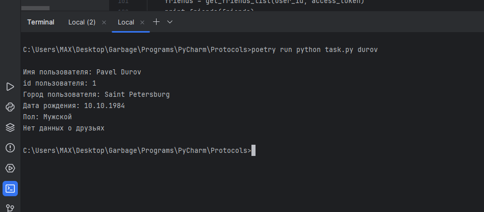

# Protocols

Это программа, которая по ID пользователя VK выводит информацию о нем

Использование: ```python task.py (ID или короткая ссылка)```

Для работы нужен файл vk_token.txt с токеном для VK API

Вызов по короткой ссылке



Вызов по ID



Ввод случайных ID



Ввод случайных ссылок



Прочие личности 

