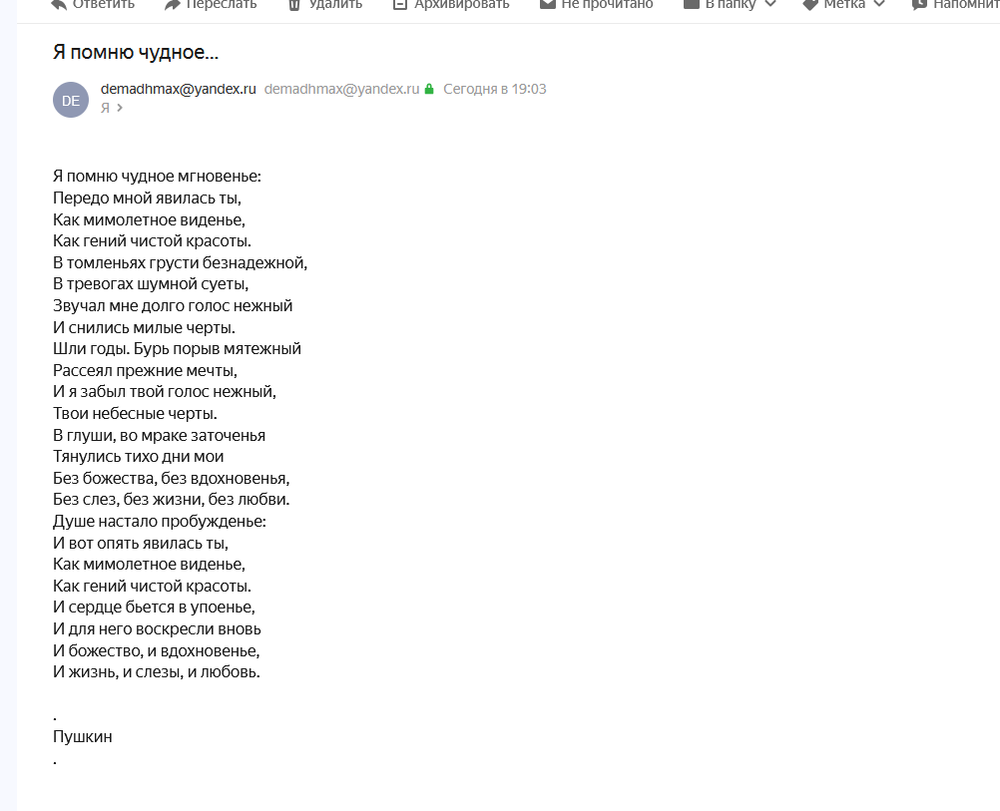
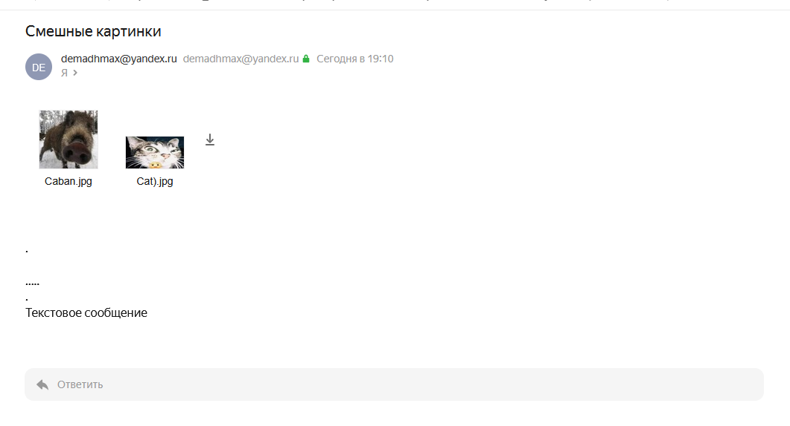
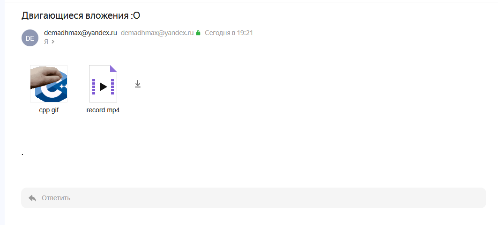

# Protocols

Программа для отправки писем с почты yandex.ru

Примеры работы:

## 1. Просто текст (С точкой в отдельной строке)

msg.txt:

    Я помню чудное мгновенье:
    Передо мной явилась ты,
    Как мимолетное виденье,
    Как гений чистой красоты.
    В томленьях грусти безнадежной,
    В тревогах шумной суеты,
    Звучал мне долго голос нежный
    И снились милые черты.
    Шли годы. Бурь порыв мятежный
    Рассеял прежние мечты,
    И я забыл твой голос нежный,
    Твои небесные черты.
    В глуши, во мраке заточенья
    Тянулись тихо дни мои
    Без божества, без вдохновенья,
    Без слез, без жизни, без любви.
    Душе настало пробужденье:
    И вот опять явилась ты,
    Как мимолетное виденье,
    Как гений чистой красоты.
    И сердце бьется в упоенье,
    И для него воскресли вновь
    И божество, и вдохновенье,
    И жизнь, и слезы, и любовь.
    
    .
    Пушкин
    .

configure.json:

    "From": "demadhmax@yandex.ru",
    "To": "maximkakaryakin@yandex.ru",
    "Subject": "Я помню чудное...",
    "Files": []

Результат:

## 2. Фотография (С пятью точками в отдельной строке)

msg.txt:

    .

    .....
    .
    Текстовое сообщение

configure.json:

    "From": "demadhmax@yandex.ru",
    "To": "maximkakaryakin@yandex.ru",
    "Subject": "Смешные картинки",
    "Files": ["Caban.jpg", "Cat).jpg"]

Результат:

## 3. Гифка и Видео

msg.txt:

    .

configure.json:

    "From": "demadhmax@yandex.ru",
    "To": "maximkakaryakin@yandex.ru",
    "Subject": "Двигающиеся вложения :O",
    "Files": ["demonstration/cpp.gif", "demonstration/record.mp4"]

Результат:

